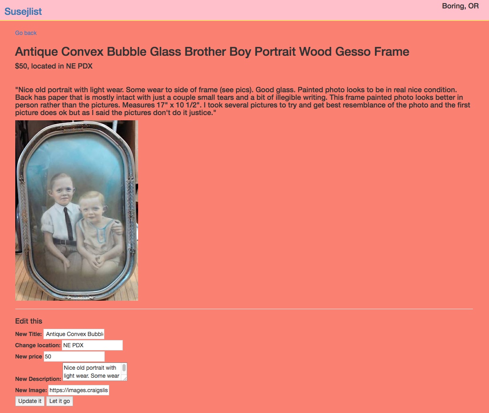
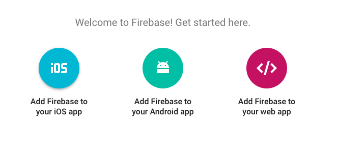

# Susej-List
#### _Epicodus Angular Javascript: Angular CLI, Dynamic Routing, and Persistent Data with Firebase, August 24, 2017_
_**By Michelle Poterek and Calla Rudolph**_

This website has been deployed for easy viewing: https://susej-list.firebaseapp.com

## User Story
* As a user, I want to see all of the categories on the main page.
* As a user, I want to click a category to navigate to a page with all its listings.
* As a user, I want to click a listing to see its contents.
* As a user, I want to add a new listing to a category of my choosing.
* As a user, I want the option to update my listing, if I need to.
* As a user, I want the option to delete my listing if I no longer need it.

## Screenshot of Program

_This image is a screenshot of an individual posting_


## Prerequisites

You will need the following things properly installed on your computer:
* [Git](https://git-scm.com/)
* [Node.js](https://nodejs.org/) (with NPM)
* [Angular](https://cli.angular.io/) (in Terminal: $ npm install -g @angular/cli@1.0.0)
* [TypeScript](https://www.typescriptlang.org/) (from NPM in Terminal: $ npm install typescript -g)
* [Bower](https://bower.io/)
* You will need Firebase to clone this project. Make a free account at [Firebase](https://firebase.google.com/).
  * Once logged in to Firebase, select `Create a New Project` and give the project a name.
  * In the Overview section, select `Add Firebase to your web app`. Keep this modal handy for use in just a moment.
  

_Need Firebase help?_
[Further Instructions](https://www.learnhowtoprogram.com/javascript/angular-extended/firebase-introduction-and-setup)

## Installation
* Open Github site in your browser: https://github.com/CallaRudolph/Susej-List
* Select green drop-down box to Clone or Download
* Open Terminal on your computer and follow these steps:

````
$ cd desktop
$ git clone <paste repository-url>
$ cd Susej-List
$ npm install
$ bower install
$ ng build
$ touch src/app/api-keys.ts
$ atom .
````

* Paste the code below into your api-keys.ts file:

````
export var masterFirebaseConfig = {
    apiKey: "xxxx",
    authDomain: "xxxx.firebaseapp.com",
    databaseURL: "https://xxxx.firebaseio.com",
    storageBucket: "xxxx.appspot.com",
    messagingSenderId: "xxxx"
  };

````
* With the information provided in the modal, replace the "xxxx" variables with your own firebase credentials in your api-keys.ts file.

## Development server

Run `ng serve` for a dev server. Navigate to `http://localhost:4200/`. The app will automatically reload if you change any of the source files.

## Technologies Used
* Angular CLI
* NodeJS
* Bower
* TypeScript
* Firebase
* Bootstrap, CSS, and HTML
* _This project was generated with [Angular CLI](https://github.com/angular/angular-cli) version 1.0.0._

## License

Copyright &copy; 2017 Michelle Poterek & Calla Rudolph

This software is licensed under the MIT license.

----

## Code scaffolding

Run `ng generate component component-name` to generate a new component. You can also use `ng generate directive/pipe/service/class/module`.

## Build

Run `ng build` to build the project. The build artifacts will be stored in the `dist/` directory. Use the `-prod` flag for a production build.

## Running unit tests

Run `ng test` to execute the unit tests via [Karma](https://karma-runner.github.io).

## Running end-to-end tests

Run `ng e2e` to execute the end-to-end tests via [Protractor](http://www.protractortest.org/).
Before running the tests make sure you are serving the app via `ng serve`.

## Further help

To get more help on the Angular CLI use `ng help` or go check out the [Angular CLI README](https://github.com/angular/angular-cli/blob/master/README.md).
